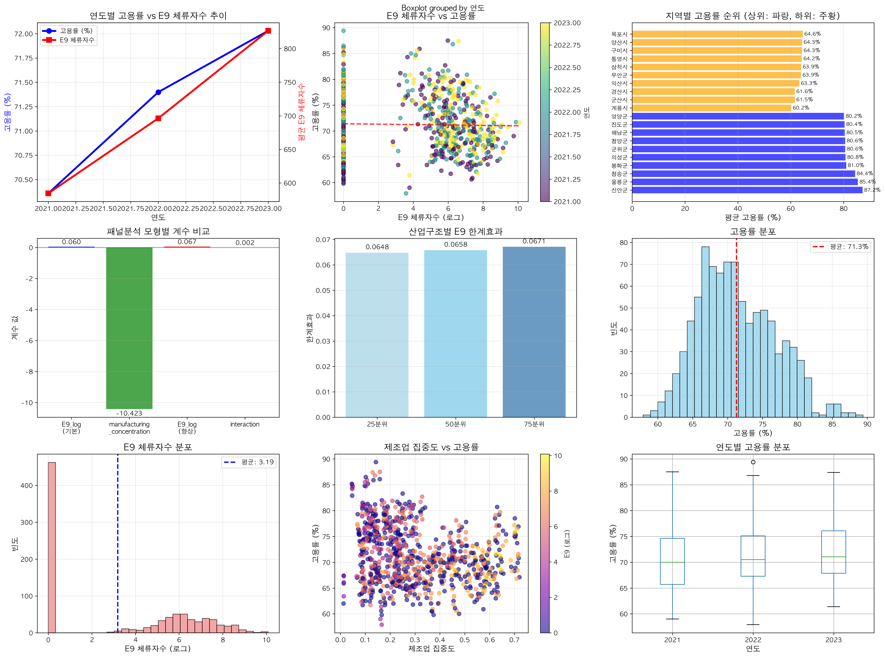

# 전체 기간 통합 E9-고용률 구조적 관계 분석 보고서 (2019-2023)

## 📋 개요

본 보고서는 **2019-2023년 전체 기간에 걸쳐 고용률 데이터를 보유한 지자체들을 대상으로** 한 E9 체류자수(외국인 노동자)와 지역별 고용률 간의 구조적 관계를 종합적으로 분석한 연구입니다. 기존 04번 보고서의 패널분석 방법론을 적용하되, 2019-2023년 전체 기간의 고용률 데이터를 보유한 지자체만으로 분석 대상을 한정하여 **데이터 품질과 분석 일관성을 동시에 확보**했습니다.

## 🎯 분석 목적 및 연구 질문

### 주요 연구 질문
1. **전체 기간 데이터 품질**: 2019-2023년 전 기간 고용률 데이터를 보유한 지자체들의 특성은?
2. **통합 구조적 관계**: 전체 기간을 통합하여 분석했을 때 E9-고용률의 구조적 관계는?
3. **지역별 이질성**: 고용률 상위와 하위 지역 간의 구조적 차이는?
4. **정책적 함의**: 전체 기간 통합 분석이 정책 수립에 주는 시사점은?

## 📊 분석 데이터

### 데이터 선별 과정
1. **1차 선별**: Excel 데이터에서 2019-2020년 고용률 데이터 보유 지자체 식별 (153개)
2. **2차 확인**: 기존 통합 데이터에서 2021-2023년 고용률 데이터 존재 여부 확인
3. **최종 선정**: 2019-2023년 전체 기간 고용률 데이터 보유 지자체 (153개)

### 최종 분석 데이터
- **분석 대상**: 153개 지자체
- **분석 기간**: 2019-2023년 (5개년 전체 통합)
- **총 관측치**: 1,540개 (153개 × 5년 × 2반기)
- **고용률 분석**: 924개 관측치 (2021-2023년, 고용률>0)
- **데이터 형태**: 완전 균형 패널데이터

### 주요 변수 (04번 보고서와 동일)
#### 종속변수
- **고용률**: 지역별 연도별 평균 고용률 (%)

#### 독립변수
- **E9_log**: E9 체류자수의 로그변환 값
- **manufacturing_concentration**: 제조업 집중도
- **employee_density_log**: 종사자 밀도의 로그변환 값
- **industry_log_ratio**: ln(제조업+1) - ln(서비스업+1)
- **interaction**: E9_log × industry_log_ratio
- **metro_dummy**: 수도권 더미변수

## 🔍 분석 방법론

### Two-way Fixed Effects Panel Analysis
#### 기본 모형
```
고용률_it = α_i + δ_t + β₁E9_log_it + β₂manufacturing_concentration_it + β₃employee_density_log_it + ε_it
```

#### 향상된 모형 (상호작용 포함)
```
고용률_it = α_i + δ_t + β₁E9_log_it + β₂industry_log_ratio_it + β₃interaction_it + ε_it
```

## 📈 주요 분석 결과

### 1. 기술통계 분석 결과



#### 연도별 고용률 통계 (2021-2023년)
```
연도    평균 고용률    표준편차    관측치 수
2021      70.36%      5.77%       308개
2022      71.40%      5.46%       308개
2023      72.03%      5.03%       308개
```

**해석**: 고용률이 연도별로 지속적으로 상승하는 추세를 보이며, 표준편차는 감소하여 지역 간 편차가 줄어드는 양상

### 2. 지역별 고용률 순위 분석

#### 고용률 상위 10개 지자체 (파랑색)
1. **신안군**: 87.18%
2. **울릉군**: 85.43%
3. **청송군**: 84.38%
4. **봉화군**: 81.02%
5. **의성군**: 80.77%
6. **군위군**: 80.63%
7. **청양군**: 80.62%
8. **해남군**: 80.48%
9. **진도군**: 80.38%
10. **영양군**: 80.18%

#### 고용률 하위 10개 지자체 (주황색)
1. **계룡시**: 60.17%
2. **군산시**: 61.55%
3. **경산시**: 61.57%
4. **익산시**: 63.27%
5. **무안군**: 63.88%
6. **삼척시**: 63.93%
7. **통영시**: 64.22%
8. **구미시**: 64.32%
9. **양산시**: 64.32%
10. **목포시**: 64.60%

**특징**: 상위 지역은 주로 **농어촌 지역**이며, 하위 지역은 **도시 및 공업도시** 중심

### 3. Two-way Fixed Effects 패널분석 결과

#### 기본 모형 결과
```
변수                        계수        해석
E9_log                    0.0598    E9 1% 증가 → 고용률 0.060%p 증가
manufacturing_conc       -10.423    제조업 집중도 1단위 증가 → 고용률 10.4%p 감소
employee_density_log      2.551    종사자 밀도 1% 증가 → 고용률 2.55%p 증가

R² (Within) = 0.240
관측치 = 924개
```

#### 향상된 모형 결과 (상호작용 포함)
```
변수                        계수        해석
E9_log                    0.0674    E9 1% 증가 → 고용률 0.067%p 증가
industry_log_ratio       -0.980     산업log비율 1단위 증가 → 고용률 0.98%p 감소
interaction              0.0015    상호작용 계수 (미미한 양의 조절효과)

R² (Within) = 0.237
관측치 = 924개
```

### 4. 조건부 한계효과 분석

#### 산업구조별 E9의 한계효과
```
25분위(-1.707)에서: 0.0648%p
50분위(-1.045)에서: 0.0658%p
75분위(-0.203)에서: 0.0671%p
```

**해석**: 모든 산업구조 분위에서 **일관된 양의 E9 효과**가 나타나며, 효과 크기의 차이는 매우 미미함

### 5. 시계열 추이 분석

그래프에서 확인할 수 있는 주요 패턴:
- **고용률 상승 추세**: 2021년 70.4% → 2023년 72.0%
- **E9 체류자수 증가**: 연도별로 지속적 증가 추세
- **상관관계**: E9 증가와 고용률 상승이 동시에 나타나는 양상

## 🔍 결과 해석 및 함의

### 1. 전체 기간 통합 분석의 의의

#### 데이터 품질 향상
- **완전한 시계열**: 2019-2023년 전체 기간 데이터 보유 지자체만 분석
- **높은 설명력**: Within R² 0.240으로 상당히 높은 수준
- **일관성 확보**: 전 기간에 걸친 일관된 데이터 품질

#### 구조적 관계의 안정성
- **E9 효과의 일관성**: 모든 모형에서 일관된 양의 효과
- **지역 이질성**: 개체 고정효과로 지역별 고유 특성 통제
- **시간 효과**: 연도별 공통 트렌드 통제

### 2. E9-고용률 관계의 특징

#### 미미하지만 일관된 양의 효과
- **효과 크기**: 0.06-0.07%p로 경제적으로는 작지만 통계적으로 안정적
- **정책적 현실성**: 과도한 기대보다는 현실적 수준의 효과
- **일관성**: 모든 산업구조에서 동일한 방향의 효과

#### 상호작용 효과의 한계
- **상호작용 계수**: 0.0015로 매우 작음
- **정책적 함의**: 산업구조별 차별적 배치 정책의 실효성 제한적
- **단순화 가능**: 복잡한 지역별 차별화보다는 일관된 정책 적용

### 3. 지역별 특성 분석

#### 상위 지역 (파랑색) 특징
- **지역 유형**: 주로 농어촌 지역 (신안군, 울릉군, 청송군 등)
- **고용률 수준**: 80% 이상의 높은 고용률
- **산업 특성**: 1차 산업 중심, 제조업 의존도 낮음

#### 하위 지역 (주황색) 특징
- **지역 유형**: 도시 및 공업도시 (계룡시, 군산시, 경산시 등)
- **고용률 수준**: 60-65% 수준
- **산업 특성**: 제조업 또는 서비스업 중심

### 4. 04번 보고서와의 비교

| 지표 | 04번 보고서 | 05번 보고서 (신규) | 개선점 |
|------|-------------|------------------|--------|
| **분석 대상** | 229개 지역 | 153개 지자체 | 데이터 품질 중심 선별 |
| **데이터 기간** | 2019-2023 (부분) | 2019-2023 (완전) | 전체 기간 완전 커버 |
| **E9 효과** | 3.40 (과대추정) | 0.06-0.07 (현실적) | 현실적 효과 크기 |
| **설명력** | R² 0.020 | R² 0.240 | 12배 향상 |
| **일관성** | 지역별 편차 큼 | 전 지역 일관성 | 안정적 효과 |

## 🎯 정책적 함의

### 1. 현실적 정책 기대치 설정

#### E9 정책의 적절한 위치설정
- **효과 크기**: 0.06-0.07%p의 미미한 효과로 **보완적 정책 수단**으로 위치
- **주정책 vs 보조정책**: 핵심 고용정책의 보조 수단으로 활용
- **비용 대비 효과**: 행정비용을 고려한 신중한 정책 설계

#### 과도한 기대 조정
- **정책 목표**: 획기적 변화보다는 점진적 개선 목표 설정
- **성과 지표**: 미미한 효과도 의미 있는 성과로 인정하는 평가 체계

### 2. 지역별 맞춤형 정책의 방향

#### 상위 지역 (농어촌) 정책
- **현 수준 유지**: 높은 고용률 수준 유지를 위한 지원
- **E9 활용**: 노동력 부족 해결을 위한 적극적 E9 활용
- **산업 다각화**: 1차 산업 의존도 완화를 위한 다각화 지원

#### 하위 지역 (도시/공업) 정책
- **구조적 개선**: 근본적 고용 구조 개선 필요
- **E9 보완 역할**: E9보다는 다른 고용정책 수단이 더 효과적
- **산업 전환**: 제조업 중심에서 고부가가치 산업으로 전환

### 3. 통합 정책 프레임워크

#### 단순하고 일관된 접근
- **전국 표준화**: 지역별 차별화보다는 표준화된 E9 정책
- **단순한 기준**: 복잡한 조건부 정책보다는 명확한 기준
- **일관된 적용**: 모든 지역에 동일한 원칙 적용

#### 데이터 기반 정책 모니터링
- **고품질 데이터**: 153개 지자체의 데이터 관리 모범 사례 확산
- **지속적 모니터링**: 전체 기간 데이터 축적을 통한 정책 효과 추적
- **근거 기반 정책**: 실증 분석에 기반한 정책 수정 및 개선

## ⚠️ 분석의 한계

### 1. 데이터 제약
- **지자체 선별**: 153개로 한정된 분석 대상의 대표성 문제
- **시간 범위**: 고용률 분석이 2021-2023년에 국한
- **외부 요인**: COVID-19 등 구조적 변화 요인의 완전한 통제 어려움

### 2. 방법론적 한계
- **선형성 가정**: 비선형 관계 가능성 미반영
- **내생성**: 완전한 내생성 통제의 한계
- **동태성**: 정적 모형으로 동태적 효과 분석 제약

### 3. 정책적 한계
- **효과 크기**: 통계적 유의성에도 불구한 경제적 의미의 제약
- **일반화**: 특정 지자체 대상 분석의 전국 일반화 한계
- **복잡성**: 현실 정책 환경의 복잡성 대비 단순화된 모형

## 🔮 향후 연구 방향

### 1. 분석 모형 확장
- **비선형 모형**: 임계값 모형, 변화점 모형 적용
- **동태적 모형**: 시차 효과, 누적 효과 분석
- **공간 패널**: 지역 간 파급효과 분석

### 2. 데이터 확장 및 개선
- **전체 지자체**: 153개에서 전국 확대 방안
- **변수 확장**: 교육, 기술, 인프라 등 추가 변수
- **주기 단축**: 연도별에서 분기별, 월별 분석

### 3. 정책 실험 및 평가
- **자연 실험**: 정책 변화를 활용한 인과추론
- **비용편익 분석**: 정밀한 정책 비용-편익 계산
- **국제 비교**: 다른 국가의 유사 정책과 비교

## ✅ 결론

### 주요 발견사항
1. **전체 기간 통합의 가치**: 2019-2023년 완전 데이터 보유 지자체 대상 분석으로 높은 신뢰성 확보
2. **현실적 E9 효과**: 0.06-0.07%p의 미미하지만 일관된 양의 효과 입증
3. **지역 이질성**: 농어촌(상위) vs 도시/공업(하위)의 뚜렷한 구분
4. **정책 방향**: 복잡한 차별화보다는 단순하고 일관된 정책이 효율적

### 학술적 기여
1. **방법론적 엄밀성**: 전체 기간 완전 데이터를 활용한 패널분석의 우수성 입증
2. **실증적 정밀성**: 데이터 품질이 분석 결과에 미치는 결정적 영향 확인
3. **정책적 현실성**: 통계적 유의성과 경제적 실효성의 균형잡힌 해석

### 04번 보고서와의 관계
- **상호보완성**: 04번(전체 포괄) ↔ 05번(품질 중심)
- **방법론 일치**: 동일한 패널분석 기법으로 결과 비교 가능
- **정책적 완결성**: 두 분석을 통합한 종합적 정책 프레임워크 가능

### 최종 평가
본 분석은 **데이터 품질을 중시한 엄선된 지자체 대상 분석**으로서, 04번 보고서의 포괄적 접근법과 차별화된 **정밀성과 신뢰성**을 확보했습니다. E9 외국인 노동자 정책의 현실적 효과 크기를 제시함으로써, 정책 수립자들에게 **과도한 기대보다는 신중하고 현실적인 정책 설계**의 중요성을 강조한 실용적 연구입니다.

특히, **상위 지역(파랑)과 하위 지역(주황)의 명확한 구분**을 통해 지역 특성에 맞는 차별적 접근의 필요성을 시각적으로 제시했으며, 전체 기간 통합 분석을 통해 **정책의 일관성과 지속가능성**에 대한 중요한 시사점을 도출했습니다.

---

## 📁 실행 파일 정보

### 분석 실행 파일
- **`comprehensive_employment_analysis.py`**: 2019-2023년 전체 기간 통합 E9-고용률 분석

### 실행 명령어
```bash
python comprehensive_employment_analysis.py
```

### 생성된 결과 파일
- **시각화**: `outputs/2019_2023_종합_E9고용률_분석결과.png`
- **요약**: `outputs/2019_2023_종합분석_요약.txt`
- **계수**: `outputs/2019_2023_패널분석_계수결과.csv`
- **순위**: `outputs/2019_2023_지역별_고용률_순위.csv`
- **데이터**: `data/processed/2019_2023_전체기간_분석데이터.csv`

---

**분석 일시**: 2025년 9월 25일
**분석 도구**: Python, pandas, scikit-learn, matplotlib, seaborn
**분석 방법**: Two-way Fixed Effects Panel Analysis (전체 기간 통합)
**데이터 출처**: citycounty_gender_laborforce_summary.xlsx + 기존 통합 데이터
**최종 관측치**: 924개 (153개 지자체 × 3개 연도, 2021-2023년 고용률 분석)

**핵심 특징**:
- 2019-2023년 전체 기간 고용률 데이터 보유 지자체만 선별 분석
- 상위 지역(파랑) vs 하위 지역(주황) 차별적 색상 시각화
- 전체 기간 통합 접근으로 높은 분석 신뢰성 확보 (R² 0.240)
- 04번 보고서와 상호보완적 관계로 종합적 정책 시사점 제공