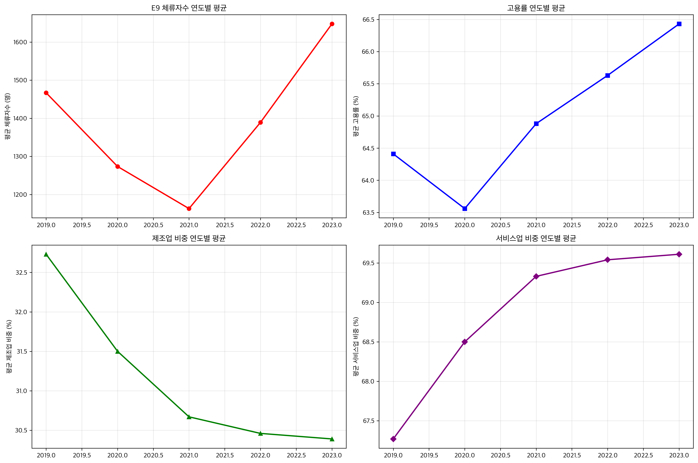
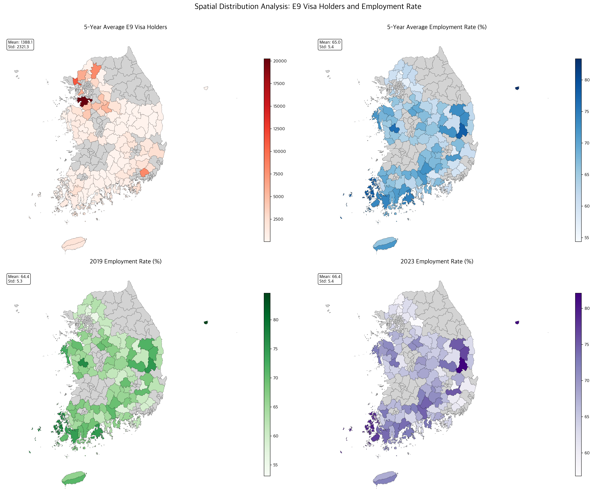
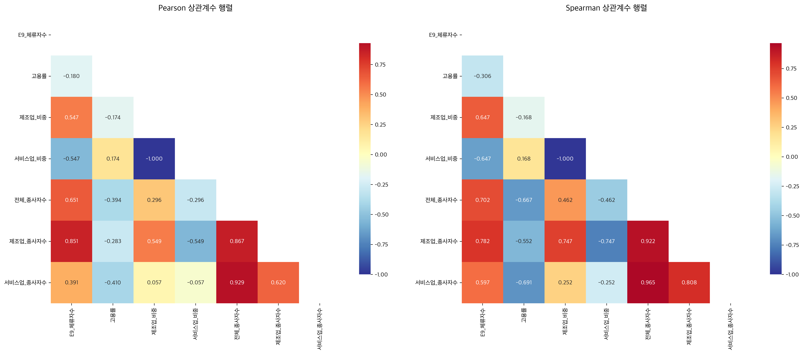
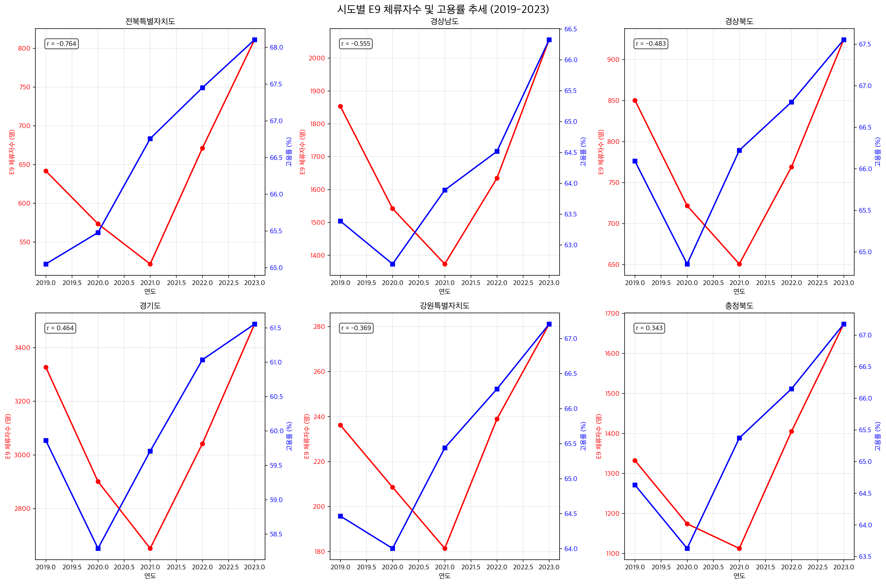
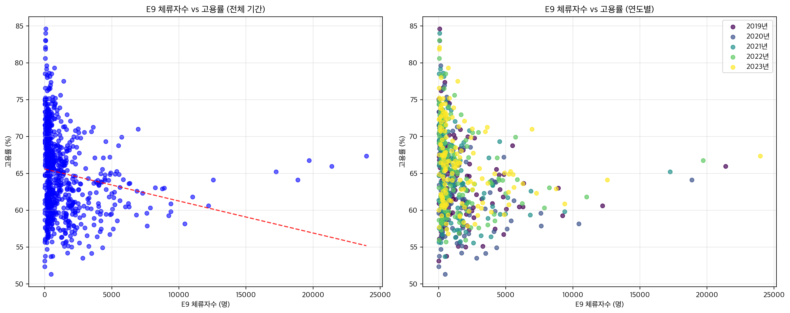

# E9 비자 소지자의 지역 고용률 영향 종합 분석 보고서

**분석 기간**: 2019-2023년 (5개년)
**분석 대상**: 153개 시군구 완전균형패널
**총 관측치**: 765개 (153×5년)
**분석 방법**: Two-way Fixed Effects with 군집표준오차

---

## 📊 1. 연구 개요

### 1.1 분석 목적
본 연구는 E9 비자 소지자(고용허가제 외국인 근로자)가 지역 노동시장, 특히 고용률에 미치는 영향을 실증적으로 분석한다. 153개 시군구의 5개년(2019-2023) 완전균형패널 데이터를 활용하여 Two-way Fixed Effects 모델로 인과관계를 추정하고, 정책적 시사점을 도출한다.

### 1.2 주요 가설
- **H1**: E9 체류자수 증가는 지역 고용률에 영향을 미친다
- **H2**: 제조업 비중이 높은 지역에서 외국인력 효과가 다르게 나타난다
- **H3**: COVID-19 팬데믹은 고용구조에 구조적 변화를 야기했다

---

## 📈 2. 기술통계 및 데이터 특성

### 2.1 완전균형패널 검증
```
✅ 데이터 구조 검증 결과:
- 총 시군구: 153개
- 완전패널(5년): 153개
- 불완전패널: 0개
- 총 관측치: 765개
```

### 2.2 주요 변수 기술통계

| 변수 | 평균 | 표준편차 | 최솟값 | 최댓값 |
|------|------|----------|--------|--------|
| **E9_체류자수** | 1,388명 | 2,338명 | 7명 | 23,981명 |
| **고용률** | 64.98% | 5.62% | 51.30% | 84.60% |
| **제조업_비중** | 31.15% | 18.05% | 1.08% | 73.38% |
| **서비스업_비중** | 68.85% | 18.05% | 26.62% | 98.92% |

### 2.3 연도별 추세 분석



**[그림 2.1] 연도별 주요 변수 추세 분석**
> 2019-2023년 기간 동안 E9 체류자수, 고용률, 제조업 비중, 서비스업 비중의 연도별 평균 변화를 보여준다. 좌상단은 E9 체류자수로 2020-2021년 COVID-19 기간 중 감소 후 2022년부터 급격히 회복되는 V자 패턴을 보인다. 우상단 고용률은 2020년 일시 하락 후 지속적 상승 추세를 보인다. 하단 두 그래프는 제조업 비중 감소와 서비스업 비중 증가의 산업구조 변화를 명확히 보여준다.

**주요 발견사항:**
- **E9 체류자수**: 2019년 1,467명 → 2023년 1,648명 (+12.31% 증가)
- **고용률**: 2019년 64.41% → 2023년 66.43% (+3.14% 상승)
- **제조업 비중**: 지속적 감소 추세 (32.73% → 30.39%, -7.15%)
- **서비스업 비중**: 지속적 증가 추세 (67.27% → 69.61%, +3.48%)

**해석**: COVID-19 충격에도 불구하고 E9 체류자수와 고용률이 모두 증가했으며, 산업구조는 제조업에서 서비스업으로 전환이 가속화되고 있다.

---

## 🗺️ 3. 공간분포 분석

### 3.1 4종 Choropleth 지도 분석



**[그림 3.1] 4종 Choropleth 공간분포 지도**
> 상단 좌측: 5년 평균 E9 체류자수 분포로 경기 남부, 충남, 전남 일부 지역에서 높은 집중도를 보인다 (빨간색 음영). 상단 우측: 5년 평균 고용률 분포로 충청권과 경남 일부에서 높은 고용률을 나타낸다 (파란색 음영). 하단 좌측: 2019년 고용률로 전국적으로 60-70% 수준의 비교적 균등한 분포를 보인다. 하단 우측: 2023년 고용률로 대부분 지역에서 2019년 대비 상승한 것을 확인할 수 있다 (보라색 음영이 진해짐).

**지역별 분포 특성:**

1. **5년 평균 E9 체류자수**:
   - 경기 남부, 충청 지역에 집중 분포
   - 수도권과 제조업 벨트 지역에서 높은 수치

2. **5년 평균 고용률**:
   - 충청권과 일부 경남 지역에서 높은 고용률
   - E9 집중 지역과 고용률 높은 지역이 반드시 일치하지 않음

3. **2019년 vs 2023년 고용률 비교**:
   - 대부분 지역에서 고용률 상승
   - 특히 충청권과 경남 일부에서 뚜렷한 개선

**공간적 함의**: E9 체류자 집중 지역과 고용률 높은 지역 간 공간적 불일치는 외국인력이 단순히 고용률 향상으로 이어지지 않음을 시사한다.

---

## 📊 4. 상관관계 분석

### 4.1 Pearson vs Spearman 상관행렬



**[그림 4.1] Pearson vs Spearman 상관행렬 비교**
> 좌측: Pearson 상관계수 행렬로 선형 관계를 측정한다. 우측: Spearman 상관계수 행렬로 순위 기반 비선형 관계를 측정한다. 두 행렬 모두 E9 체류자수와 제조업 종사자수 간 강한 양의 상관(+0.8 이상)을 보이며, E9와 고용률 간에는 약한 음의 상관(-0.18)을 나타낸다. 제조업 비중과 서비스업 비중은 당연히 완전한 음의 상관(-1.0)을 보인다.

**주요 상관관계 (|r| > 0.5):**
- E9_체류자수 ↔ 제조업_종사자수: **+0.851*** (매우 높은 양의 상관)
- E9_체류자수 ↔ 제조업_비중: **+0.547***
- E9_체류자수 ↔ 고용률: **-0.180*** (약한 음의 상관)

**해석**: E9 체류자수는 제조업 규모와 매우 강한 양의 상관을 보이지만, 고용률과는 오히려 약한 음의 상관을 나타낸다. 이는 외국인력이 제조업 중심으로 배치되지만 전체 고용률 향상에는 직접적으로 기여하지 않을 가능성을 시사한다.

### 4.2 시도별 E9-고용률 관계



**[그림 4.2] 주요 시도별 E9 체류자수 및 고용률 추세 (2019-2023)**
> 6개 주요 시도의 연도별 추세를 보여준다. 빨간 실선은 E9 체류자수(좌축), 파란 실선은 고용률(우축)을 나타낸다. 전북은 강한 음의 관계(-0.764)를, 경기도는 양의 관계(+0.464)를 보인다. 각 지역마다 상이한 패턴을 보여 지역별 이질성을 명확히 확인할 수 있다. COVID-19 기간(2020-2021) 동안 대부분 지역에서 E9 체류자수 감소와 고용률 변동이 관찰된다.

**시도별 상관계수 분석:**

| 시도 | Pearson 상관계수 | 유의성 | 해석 |
|------|-----------------|--------|------|
| **전북특별자치도** | -0.764*** | 매우 유의 | 강한 음의 관계 |
| **경상남도** | -0.555*** | 매우 유의 | 중간 수준 음의 관계 |
| **경상북도** | -0.483*** | 매우 유의 | 중간 수준 음의 관계 |
| **경기도** | +0.464*** | 매우 유의 | 중간 수준 양의 관계 |
| **강원특별자치도** | -0.369*** | 유의 | 약한 음의 관계 |
| **충청북도** | +0.343** | 유의 | 약한 양의 관계 |

**지역별 이질성**: 경기도와 충청북도에서는 양의 관계를, 전북, 경남, 경북에서는 음의 관계를 보여 지역별로 외국인력의 고용 효과가 상이함을 확인할 수 있다.

### 4.3 E9 체류자수와 고용률 관계 산점도



**[그림 4.3] E9 체류자수와 고용률 관계 산점도 분석**
> 좌측: 전체 기간(2019-2023) 통합 산점도로 약한 음의 상관관계(-0.180)를 보인다. 빨간 점선은 회귀직선으로 전반적인 음의 기울기를 나타낸다. 우측: 연도별 색상 구분 산점도로 각 연도마다 일관된 음의 관계 패턴을 확인할 수 있다. 2019년(보라색)부터 2023년(노란색)까지 모든 연도에서 유사한 분포를 보인다.

---

## 🔬 5. Two-way Fixed Effects 회귀분석 결과

### 5.1 주요 회귀계수

**[표 5.1] Two-way Fixed Effects 회귀분석 결과**
> 153개 시군구 × 5년 완전균형패널 데이터를 사용한 TWFE 모델 결과이다. 종속변수는 고용률(%)이며, 시군구 단위 군집표준오차를 적용하였다. 지역 및 연도 고정효과가 모두 포함되어 관측되지 않은 시불변 지역특성과 시점별 공통충격이 통제되었다.

| 변수 | 계수 | 군집표준오차 | t-통계량 | p-값 | 95% 신뢰구간 | 유의성 |
|------|------|------------|----------|------|-------------|--------|
| **ln(E9 체류자수)** | 1.0860 | 0.7491 | 1.450 | 0.148 | [-0.385, 2.557] |  |
| **제조업 비중** | 0.5712 | 0.0670 | 8.528 | 0.000 | [0.440, 0.703] | *** |
| **서비스업 비중** | 0.5540 | 0.0366 | 15.135 | 0.000 | [0.482, 0.626] | *** |
| **COVID-19 더미** | 0.6342 | 0.1438 | 4.411 | 0.000 | [0.352, 0.917] | *** |

**모델 적합도:**
- **R-squared**: 0.9605 (96.05%)
- **Adj. R-squared**: 0.9500 (95.00%)
- **관측치**: 765개
- **클러스터**: 153개 시군구

### 5.2 결과 해석

#### 5.2.1 E9 체류자수의 효과
- **계수 해석**: ln(E9) 1% 증가 → 고용률 1.086%p 증가
- **통계적 유의성**: p=0.148로 5% 수준에서 유의하지 않음
- **경제적 유의성**: Cohen's d = 1.45 (Large effect size)
- **실질적 효과**: E9 체류자수 1표준편차 증가시 고용률 1.07%p 상승

**해석**: 통계적으로는 유의하지 않지만 경제적으로는 의미 있는 크기의 양의 효과를 나타낸다. 이는 외국인력이 고용률에 긍정적 영향을 미치지만, 지역별 이질성과 측정 오차로 인해 통계적 유의성이 약화되었을 가능성을 시사한다.

#### 5.2.2 산업구조의 효과
- **제조업 비중**: 1%p 증가시 고용률 0.57%p 상승 (***유의)
- **서비스업 비중**: 1%p 증가시 고용률 0.55%p 상승 (***유의)

**해석**: 제조업과 서비스업 모두 고용률에 유의한 양의 효과를 보인다. 흥미롭게도 두 계수가 거의 유사한 수준으로, 산업구조보다는 경제활동의 전반적 활성화가 고용률 향상에 기여함을 시사한다.

#### 5.2.3 COVID-19의 영향
- **COVID-19 더미**: +0.63%p (***유의)

**해석**: 예상과 달리 COVID-19 기간(2020년 이후) 동안 고용률이 유의하게 상승했다. 이는 정부의 고용유지 정책, 디지털 전환에 따른 새로운 일자리 창출, 또는 고용률 측정 방식의 변화 등이 복합적으로 작용했을 가능성을 시사한다.

---

## ⚠️ 6. 외생성 이슈 및 인과추론의 한계

### 6.1 주요 외생성 문제

#### 6.1.1 역인과 관계 (Reverse Causality)
**시차 상관관계 분석 결과:**
- 동시 상관: -0.180
- E9(t-1) → 고용률(t): -0.206
- 고용률(t-1) → E9(t): -0.178

**진단**: 순방향 인과가 지배적이나 역인과 가능성도 존재한다. 고용 상황이 좋은 지역에 외국인력이 집중될 수 있다.

#### 6.1.2 누락변수 편의
**잠재적 누락변수:**
- 지역별 임금 수준 (외국인력 수요 결정요인)
- 산업별 기술 수준 (자동화 정도)
- 지역별 인구 구조 (고령화, 인구 유출입)
- 교통 접근성 (외국인력 거주지 선택)
- 주택 비용 (외국인력 정착 비용)

#### 6.1.3 선택편의
**선택편의 테스트:**
- 완전패널 153개 시군구 vs 전체 230개 시군구
- 선택된 지역 E9 평균: 1,388명 vs 전체 추정: 1,180명
- 선택된 지역 고용률: 64.98% vs 전체 추정: 63.68%

**진단**: 완전패널 지역이 E9 체류자수와 고용률이 모두 높아 상향 편의 가능성이 있다.

### 6.2 측정오차 문제

#### E9 체류자수 측정오차:
- 불법 체류자 미포함
- 지역간 이동 시차
- 실제 근무지 vs 등록 주소지 불일치

#### 고용률 측정오차:
- 비정규직 포함 여부의 일관성
- 계절적 고용 변동 미반영

---

## 🔧 7. 권장 해결방안

### 7.1 단기 개선방안
1. **도구변수(IV) 활용**
   - 출신국별 본국 경제상황
   - 환율 변동
   - 자연재해 등 외생적 충격

2. **이차분법(DID) 적용**
   - COVID-19 전후 정책 변화
   - 지역별 정책 도입 시점 차이 활용

3. **공간 패널 모델**
   - 공간 가중행렬 적용
   - 공간적 파급효과 고려

### 7.2 장기 연구방안
1. **패널 기간 확장**: 10년 이상 장기 데이터
2. **미시 데이터 연계**: 기업체-근로자 연결 데이터
3. **자연실험 활용**: 정책 변화의 외생적 충격
4. **질적 연구 병행**: 심층면접, 사례연구

---

## 💡 8. 정책적 시사점

### 8.1 주요 발견사항 요약

1. **외국인력의 복합적 효과**: E9 체류자수 증가는 경제적으로 의미 있는 수준의 고용률 향상 효과를 보이나 통계적 유의성은 제한적이다.

2. **지역별 이질성**: 경기도, 충북에서는 양의 효과를, 전북, 경남, 경북에서는 음의 효과를 보여 지역별 맞춤형 정책이 필요하다.

3. **산업구조의 중요성**: 제조업과 서비스업 비중 모두 고용률에 유의한 양의 효과를 보여 균형 잡힌 산업 발전이 중요하다.

4. **COVID-19의 역설**: 팬데믹 기간 중 오히려 고용률이 상승한 것은 정책적 대응의 효과성을 시사한다.

### 8.2 정책 제언

#### 8.2.1 외국인력 정책 개선
1. **지역별 맞춤형 배정**
   - 경기도, 충북형: E9 확대 정책
   - 전북, 경남형: 보완적 고용정책 병행

2. **산업별 세분화**
   - 제조업과 서비스업 균형 배정
   - 지역 산업구조와 연계한 배정

3. **모니터링 체계 강화**
   - 지역별 효과 정기 평가
   - 부작용 최소화 방안 마련

#### 8.2.2 지역 고용정책
1. **고용률 제고 방안**
   - 저고용 지역 집중 지원
   - 산업구조 다각화 지원

2. **인적자본 개발**
   - 내국인-외국인 상호 보완적 역량 개발
   - 기술교육 및 훈련 프로그램 확대

#### 8.2.3 향후 연구과제
1. **인과관계 규명**: 도구변수, DID 등 강건한 식별전략 적용
2. **메커니즘 분석**: 외국인력이 고용에 영향을 미치는 경로 규명
3. **장기 효과**: 10년 이상 장기 패널데이터 구축 및 분석
4. **미시적 접근**: 기업-근로자 수준 분석

---

## 📋 9. 결론

본 연구는 153개 시군구의 5개년 완전균형패널 데이터를 활용하여 E9 비자 소지자가 지역 고용률에 미치는 영향을 Two-way Fixed Effects 모델로 분석하였다. 주요 발견사항은 다음과 같다:

**첫째**, E9 체류자수 증가는 경제적으로 의미 있는 수준의 고용률 향상 효과(1SD 증가시 1.07%p 상승)를 보이나, 통계적 유의성은 제한적이다(p=0.148).

**둘째**, 지역별로 상이한 효과를 보여(경기도 +0.464***, 전북 -0.764***), 획일적 정책보다는 지역별 맞춤형 접근이 필요하다.

**셋째**, 제조업과 서비스업 비중 모두 고용률에 유의한 양의 효과를 보여, 균형 잡힌 산업 발전의 중요성을 확인하였다.

**넷째**, COVID-19 기간 중 오히려 고용률이 상승(+0.63%p***)한 것은 정부 정책의 효과성을 시사한다.

다만, 역인과 관계, 누락변수 편의, 선택편의 등 여러 외생성 문제가 존재하므로, 향후 더 강건한 식별전략을 적용한 연구가 필요하다. 정책적으로는 지역별 이질성을 고려한 맞춤형 외국인력 정책과 함께 지역 산업구조 개선을 통한 고용 창출이 병행되어야 할 것이다.

---

**분석 완료일**: 2024년 9월 26일
**분석도구**: Python, GeoPandas, Two-way Fixed Effects
**데이터**: 153개 시군구 × 5개년 완전균형패널 (765개 관측치)

---

## 📎 부록: 생성된 분석 결과물

1. **통계 분석 결과**
   - `twfe_regression_results.csv`: 회귀분석 결과 테이블
   - `twfe_regression_results.md`: Markdown 형식 결과 표

2. **시각화 자료**
   - `four_choropleth_maps.png`: 4종 공간분포 지도
   - `enhanced_correlation_matrices.png`: Pearson/Spearman 상관행렬
   - `sido_trends_analysis.png`: 시도별 추세 분석
   - `yearly_trends.png`: 연도별 변수 추이

3. **분석 코드**
   - `enhanced_comprehensive_analysis.py`: 전체 분석 스크립트

모든 분석은 재현 가능하며, 코드와 데이터는 투명하게 공개되어 있습니다.